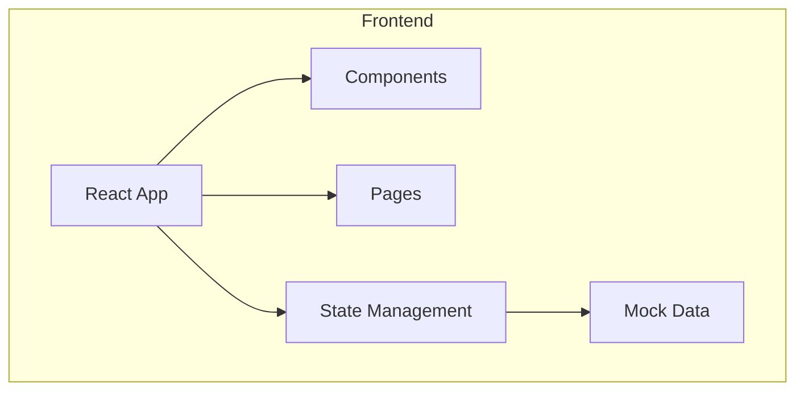
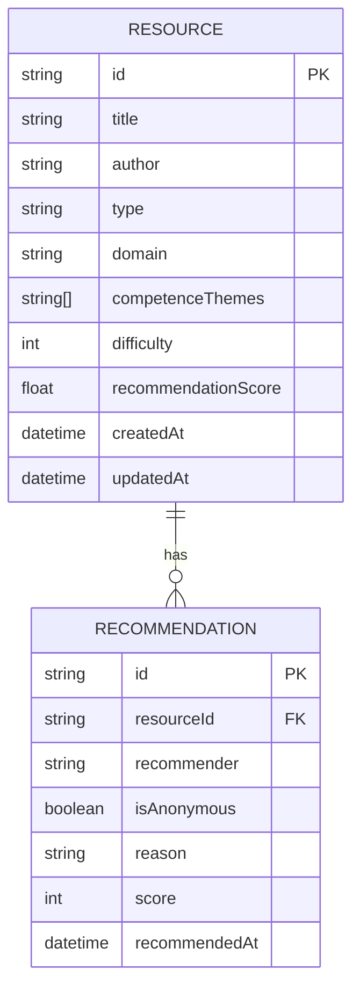

## 1. 架构设计



## 2. 技术描述
- **前端**：React@18 + TypeScript + Vite + TailwindCSS + Zustand
- **初始化工具**：vite-init
- **后端**：无（纯前端原型）
- **数据库**：无（使用Mock数据）
- **图表库**：ECharts
- **UI组件库**：Ant Design（可选）或自定义组件
- **图标**：Lucide React

## 3. 路由定义
| 路由 | 用途 |
|-------|---------|
| / | 首页 - 雷达图展示 |
| /list | 列表页 - 资料列表和筛选 |
| /detail/:id | 详情页 - 资料详细信息 |

## 4. 数据模型

### 4.1 数据模型定义



### 4.2 TypeScript 类型定义

```typescript
export type Domain =
  | 'ai-engineering'
  | 'ai-product-design'
  | 'agent-and-intelligent-systems'
  | 'ai-organizational-transformation'
  | 'data-intelligence-and-knowledge'
  | 'ai-business-implementation'
  | 'ai-ethics-and-governance'
  | 'ai-frontier-trends';

export interface Recommendation {
  id: string;
  recommender: string;
  isAnonymous: boolean;
  reason: string;
  score: number;
  recommendedAt: string;
}

export interface Resource {
  id: string;
  title: string;
  author?: string;
  type: 'book';
  domain: Domain;
  competenceThemes: string[];
  difficulty: number;
  recommendationScore: number;
  recommendations: Recommendation[];
  createdAt: string;
  updatedAt: string;
}

export interface FilterOptions {
  domains: Domain[];
  minScore: number;
  searchQuery: string;
}
```

## 5. 文件结构设计

```
ai-native-radar/
├── src/
│   ├── components/
│   │   ├── RadarChart/
│   │   │   └── index.tsx
│   │   ├── ResourceCard/
│   │   │   └── index.tsx
│   │   ├── ResourceList/
│   │   │   └── index.tsx
│   │   ├── SearchFilter/
│   │   │   └── index.tsx
│   │   └── Navbar/
│   │       └── index.tsx
│   ├── pages/
│   │   ├── Home/
│   │   │   └── index.tsx
│   │   ├── List/
│   │   │   └── index.tsx
│   │   └── Detail/
│   │       └── index.tsx
│   ├── data/
│   │   └── mockData.ts
│   ├── types/
│   │   └── index.ts
│   ├── store/
│   │   └── useResourceStore.ts
│   ├── App.tsx
│   └── main.tsx
├── package.json
├── vite.config.ts
├── tailwind.config.js
├── postcss.config.js
└── tsconfig.json
```

## 6. 主要模块说明

### 6.1 雷达图组件
- 使用 ECharts 实现同心圆雷达图
- 8个领域按扇形分区
- 资料位置由难度决定（内圈1，外圈5）
- 支持缩放和拖拽平移

### 6.2 状态管理
- 使用 Zustand 管理全局状态
- 存储资源数据和筛选条件
- 提供资源查询和筛选方法

### 6.3 导航和路由
- 使用 React Router DOM
- 响应式导航栏
