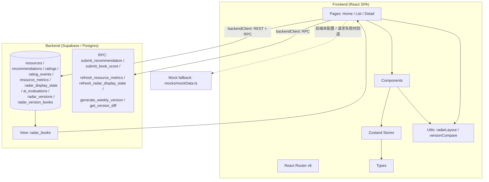

# AI-Native 读书雷达 - 架构设计

> 本文件描述**当前实际原型**的架构（截至 2026-08 更新）。
> 技术基线以 `src/`、`supabase/` 真实代码为准；产品视角见 [prd.md](./prd.md)、[system-overview.md](./system-overview.md)。

## 1. 架构总览


```mermaid
graph TB
    subgraph "Frontend (React SPA)"
        R[React Router v6]
        P[Pages: Home / List / Detail]
        C[Components]
        S[Zustand Stores]
        U[Utils: radarLayout / versionCompare]
        T[Types]
    end

    subgraph "Backend (Supabase / Postgres)"
        DB[(resources / recommendations / ratings /
            rating_events / resource_metrics /
            radar_display_state / ai_evaluations /
            radar_versions / radar_version_books)]
        V["View: radar_books"]
        RPC["RPC: submit_recommendation / submit_book_score /
             refresh_resource_metrics / refresh_radar_display_state /
             generate_weekly_version / get_version_diff"]
    end

    C --> S
    P --> C
    P --> U
    C --> U
    S --> T

    P -->|backendClient: REST + RPC| DB
    P -->|backendClient: RPC| RPC
    DB --> V
    V --> P

    M[Mock fallback: mocks/mockData.ts]
    P -. "后端未配置 / 请求失败时回退" .-> M
```

## 2. 技术栈

- **前端**：React@18 + TypeScript + Vite@5 + TailwindCSS + Zustand + React Router v6 + lucide-react
- **初始化工具**：Vite（`vite-init`）
- **后端**：Supabase（Postgres）。未配置 `VITE_SUPABASE_URL` / `VITE_SUPABASE_ANON_KEY` 时，前端回退到本地 mock 数据
- **数据库**：Supabase Postgres（9 张业务表 + 1 视图，见 §4）
- **雷达可视化**：**自研自定义 SVG 组件**（`src/components/RadarChart`），非 ECharts
  - `echarts` / `echarts-for-react` 虽仍在 `package.json` 依赖中，但 `src/` 未引用，实际渲染完全由自研 SVG 完成
- **UI 组件库**：无重型组件库，全部为 Tailwind 自定义组件（纸感主题基于 `index.css` 中的 `--paper-*` 变量）
- **图标**：Lucide React

## 3. 路由定义

| 路由 | 页面 | 用途 |
|-------|---------|---------|
| `/` | Home | 首页 - 雷达图主体 + 8 领域书名框环绕 + 左侧筛选面板 + 详情侧栏/评分抽屉/推荐抽屉浮层 |
| `/list` | List | 列表页 - 资料列表、搜索筛选、推荐书架、评分抽屉 |
| `/detail/:id` | Detail | 详情页 - 资料详细信息与评分入口 |

所有路由嵌套在 `Layout`（含 `Navbar` + 全局挂载的 `RecommendationDrawer`）之下。

## 4. 数据模型

### 4.1 数据库（Supabase）

迁移文件：`supabase/migrations/001_initial_schema.sql`、`002_expose_curation_fields.sql`、`003_radar_versions.sql`。

| 表 | 职责 |
|----|------|
| `resources` | 资料主表（书、文章、课程等），`status = 'published'` 才进入雷达 |
| `recommendations` | 用户推荐记录（推荐人、理由、推荐分、处理状态） |
| `ratings` | 用户评分记录（评分值、理由、修改记录） |
| `rating_events` | 评分操作事件流水（create / update） |
| `resource_metrics` | 聚合指标（推荐指数、评分人数、推荐次数、热度、置信度） |
| `radar_display_state` | 雷达展示状态（扇区、圈层、坐标、视觉权重、最近更新态） |
| `ai_evaluations` | AI 辅助评估（领域/难度建议、质量分、置信度、质量信号） |
| `radar_versions` | 周版本元数据（版本号、周区间、生成时间） |
| `radar_version_books` | 版本内每本书快照（score / votesCount / 坐标 / 视觉权重），`resource_id` 不加外键以支持幽灵书 |
| `radar_books`（视图） | 前端 Book 数据源：已发布 + 最新推荐指数聚合 + 展示字段（含 curation 字段） |

种子数据：`supabase/seeds/001_imported_books.sql`（25 本 `imported-1..25`）。

RPC：
- `submit_recommendation`（书籍推荐）
- `submit_book_score`（评分投票，create/update 语义）
- `refresh_resource_metrics`（推荐指数重算）
- `refresh_radar_display_state`（雷达展示状态刷新）
- `generate_weekly_version`（当前雷达全量快照生成新版本）
- `get_version_diff`（返回最近两版元数据 + 上一版书目快照）

### 4.2 前端类型（src/types/index.ts）

```typescript
export type Domain =
  | 'ai-engineering'
  | 'ai-product-design'
  | 'agent-and-intelligent-systems'
  | 'ai-organizational-transformation'
  | 'data-intelligence-and-knowledge'
  | 'ai-business-implementation'
  | 'ai-ethics-and-governance'
  | 'ai-frontier-trends';

export type DifficultyLevel = 1 | 2 | 3; // 入门认知 / 方法实践 / 深度进阶

export interface Book {
  id: string;
  displayNumber: number;
  title: string;
  subtitle?: string;
  author: string;
  cover?: string;
  domain: Domain;
  difficultyLevel: DifficultyLevel;
  sectorIndex: number;   // 0-7，对应领域索引
  ringIndex: number;     // 0-2，对应难度圈索引
  x: number; y: number;  // 雷达图坐标
  recommendationScore: number; // 3-5
  reasonShort: string;
  reasonFull: string;
  fitFor: string[];
  takeaways: string[];
  contentType: string;
  tags: string[];
  votesCount: number;
  recommendationCount?: number;
  ratingCount?: number;
  sourceNote?: string;
  createdAt?: string;
  updatedAt?: string;
  lastRecommendedAt?: string;
  competenceThemes: string[];
  recommendations: Recommendation[];
}

export interface FilterState {
  domains: Domain[];
  difficultyLevels: DifficultyLevel[];
  minScore: number;      // 默认 3（雷达准入门槛）
  searchQuery: string;
}

export interface ViewState {
  hoveredBookId: string | null;
  selectedBookId: string | null;
  isDetailPanelOpen: boolean;
  isSidebarCollapsed: boolean;   // 首页左侧筛选面板默认收起
  isRecommendationOpen: boolean;
}
```

另有推荐（`RecommendationScore = 3|4|5` 整星）、评分（`BookScoringScore = 3|3.5|4|4.5|5` 半星）、版本对比（`src/types/versionCompare.ts`）三套独立类型。

## 5. 文件结构

```
ai-native-radar/
├── src/
│   ├── components/
│   │   ├── Layout/                  # 路由布局（Navbar + 全局推荐抽屉挂载）
│   │   ├── Navbar/                  # 顶部导航
│   │   ├── RadarChart/              # 自研 SVG 雷达（含版本对比层、tooltip）
│   │   ├── RadarLegend/             # DomainBookCard 领域书名框（主页环绕/网格）
│   │   ├── SearchFilter/            # 领域/难度/分数/搜索 筛选面板
│   │   ├── ResourceCard/            # 列表卡片（整卡点击进详情）
│   │   ├── ResourceList/            # 列表网格
│   │   ├── DetailSidebar/           # 详情右侧抽屉
│   │   ├── ListRecommendationShelf/ # 列表页推荐书架（热度/上新/领域学习路径）
│   │   ├── RecommendationDrawer/    # 推荐抽屉（form/result/records）
│   │   ├── RecommendationForm/      # 推荐表单（整星 3/4/5）
│   │   ├── RecommendationResult/    # 推荐结果反馈
│   │   ├── RecommendationRecords/   # 推荐会话记录
│   │   ├── DraftConfirmModal/       # 关闭前草稿确认弹窗
│   │   ├── BookScoringDrawer/       # 评分抽屉（form/result/records）
│   │   ├── BookScoringForm/         # 评分表单（半星 3-5）
│   │   ├── BookScoringResult/       # 评分结果反馈
│   │   └── BookScoringRecords/      # 评分会话记录
│   ├── pages/
│   │   ├── Home/index.tsx
│   │   ├── List/index.tsx
│   │   └── Detail/index.tsx
│   ├── mocks/mockData.ts            # 25 本 imported-1..25 回退数据
│   ├── constants/index.ts           # DOMAINS / DIFFICULTIES / COLORS
│   ├── types/
│   │   ├── index.ts
│   │   └── versionCompare.ts
│   ├── store/
│   │   ├── useResourceStore.ts
│   │   ├── useRecommendationStore.ts
│   │   └── useBookScoringStore.ts
│   ├── services/
│   │   ├── backendClient.ts         # isBackendConfigured / 会话 id / callBackendRpc
│   │   ├── bookMapper.ts            # 后端行 → Book
│   │   ├── resourceService.ts       # radar_books 读取或 mock
│   │   ├── recommendationService.ts
│   │   ├── bookScoringService.ts
│   │   └── versionCompareService.ts
│   ├── utils/
│   │   ├── radarLayout.ts           # buildRadarData / 扇区几何 / 每领域 Top 8
│   │   └── versionCompare.ts        # computeVersionCompareData
│   ├── App.tsx                      # 路由定义
│   ├── index.css                    # 纸感主题 CSS 变量与覆写
│   └── main.tsx
├── supabase/
│   ├── migrations/
│   │   ├── 001_initial_schema.sql
│   │   ├── 002_expose_curation_fields.sql
│   │   └── 003_radar_versions.sql   # 含可删除的演示差异数据
│   └── seeds/
│       ├── 001_imported_books.sql
│       └── README.md
├── package.json
├── vite.config.ts
├── tailwind.config.js
├── postcss.config.js
└── tsconfig.json
```

## 6. 主要模块说明

### 6.1 雷达图组件（自研 SVG）
- `viewBox 900×900`，`maxRadius = 280`，纸感主题（`feTurbulence` grain 纸纹，`clipPath#radar-circle-clip` 只作用于圆内）。
- 8 个领域扇区按各领域书量缩放半径（莫兰迪色），3 层难度虚线环（`入门认知 / 方法实践 / 深度进阶`，半径 0.3/0.6/0.9 倍）带慢速旋转动画。
- 扇区 i 中心角 = `(i+0.5)*45° - 90°`（SVG y 向下）→ 0=右上、1=右、2=右下、3=下、4=左下、5=左、6=左上、7=上。
- 雷达点位上限：每领域 `MAX_RADAR_POINTS_PER_DOMAIN = 8`，且推荐指数 ≥ `minScore`（默认 3.0）。
- 版本对比层：被筛选隐藏但有变化的书渲染离屏迷你标记、点位上叠加「新 / ↑ / ↓」徽标；跌出雷达的书不渲染残影、不单独标注；状态优先级 `selected > hover > 对比态 > 默认`。
- tooltip 展示书名/作者/推荐指数/推荐理由摘要，跟随鼠标且避免超出视口。

### 6.2 状态管理（Zustand，三个 store）
- `useResourceStore`：`books`、`filters`（默认 `minScore: 3`、筛选面板默认收起）、`viewState`，提供 `filteredBooks()` / `openRecommendation()` 等。
- `useRecommendationStore`：推荐草稿 / 会话记录，持久化到 `sessionStorage`（`ai-native-radar:recommendation-records`）。
- `useBookScoringStore`：评分草稿 / 会话记录 / 会话有效评分快照，持久化到 `sessionStorage`（`ai-native-radar:book-scoring-records`、`ai-native-radar:book-scoring-session-scores`）。

### 6.3 后端接入与降级
- `backendClient.isBackendConfigured`：同时具备 `VITE_SUPABASE_URL` 与 `VITE_SUPABASE_ANON_KEY` 时为真。
- `resourceService.fetchBooks()`：后端可用 → 读 `radar_books` 视图（`order display_number`）→ `bookMapper` 映射为 `Book[]`；不可用或失败 → 回退 `mockData.ts` 生成的 25 本书。
- 推荐 / 评分 / 版本对比 service 各自走 RPC，失败时回退 mock（推荐用「失败测试」关键词模拟失败态；版本对比含演示差异数据）。

### 6.4 导航和路由
- React Router v6，`Layout` 包裹全部页面，`Navbar` 提供首页 / 列表页切换与全局「书籍推荐」入口。
