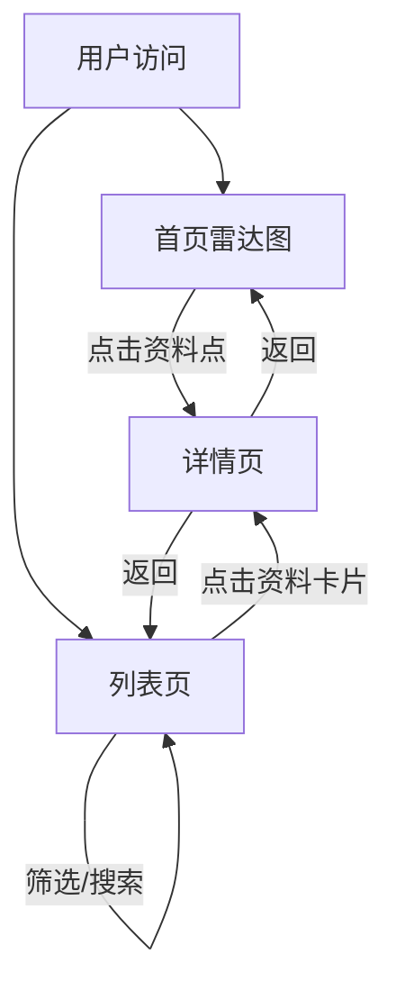

## 1. 产品概述
AI-Native 读书雷达是AI从业者共建的动态读书雷达，通过专业可信的集体推荐与评分，帮助用户快速发现高质量AI学习资料，打造AI业界高价值高信息高水平的参考平台，打破信息壁垒，帮助AI从业者快速成长。

## 2. 核心功能

### 2.1 用户角色
本阶段MVP不区分用户角色，所有访问用户均可使用浏览功能。

### 2.2 功能模块
1. **首页（雷达图）**：同心圆雷达图展示，8大领域分区，悬停显示摘要，点击进入详情
2. **列表页**：资料列表，支持按领域、推荐指数、时间筛选，支持搜索
3. **详情页**：展示完整资料信息、推荐理由、所有推荐人、能力主题标签

### 2.3 页面详情
| 页面名称 | 模块名称 | 功能描述 |
|-----------|-------------|---------------------|
| 首页（雷达图） | 雷达图组件 | 同心圆雷达图，8大领域分区，难度内圈向外圈分布，悬停显示资料摘要，点击跳转到详情页，支持缩放和拖拽平移 |
| 首页（雷达图） | 导航栏 | 品牌标识，切换到列表页的链接 |
| 列表页 | 资料列表 | 展示所有资料卡片，支持排序 |
| 列表页 | 搜索筛选 | 按书名/作者搜索，按领域、推荐指数、时间筛选 |
| 列表页 | 导航栏 | 品牌标识，切换到雷达图的链接 |
| 详情页 | 资料信息 | 展示完整资料信息、推荐理由、所有推荐人、能力主题标签 |
| 详情页 | 返回导航 | 返回上一页 |

## 3. 核心流程
用户主要有两条浏览路径：从雷达图开始探索，或从列表页开始筛选。

## 4. 用户界面设计

### 4.1 设计风格
- **主色调**：深蓝科技感 #0f172a，辅以亮蓝 #3b82f6 和青绿色 #06b6d4
- **按钮风格**：圆角矩形，轻微悬浮阴影效果
- **字体**：现代无衬线字体，标题加粗
- **布局风格**：卡片式布局，清晰的视觉层次
- **图标风格**：使用 Lucide React 线性图标

### 4.2 页面设计概述
| 页面名称 | 模块名称 | UI元素 |
|-----------|-------------|-------------|
| 首页（雷达图） | 雷达图组件 | 深蓝色背景，8个不同颜色的扇形区域，资料点用彩色圆点表示，大小与推荐指数成正比，悬停时显示卡片式摘要 |
| 首页（雷达图） | 导航栏 | 顶部固定，品牌名称在左，列表页链接在右，白色文字配深蓝色背景 |
| 列表页 | 资料列表 | 网格布局，卡片悬停有上浮效果，显示封面、标题、作者、推荐指数、领域标签 |
| 列表页 | 搜索筛选 | 顶部搜索框，下方筛选条件区，使用标签式多选 |
| 详情页 | 资料信息 | 大标题，信息分区展示，推荐理由使用引用样式，能力主题使用彩色标签 |

### 4.3 响应式
桌面优先设计，适配主流屏幕尺寸，移动端简化布局。

### 4.4 交互与动效
- 雷达图点悬停时放大并显示卡片
- 列表卡片悬停时轻微上浮并显示阴影
- 页面切换时有平滑过渡动画
- 筛选条件变化时有淡入淡出效果
