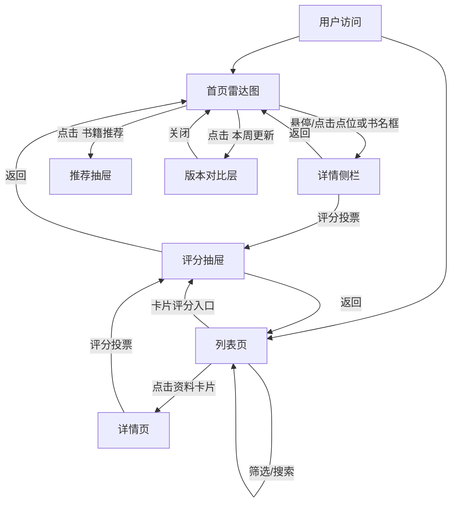

## 1. 产品概述
AI-Native 读书雷达是AI从业者共建的动态读书雷达，通过专业可信的集体推荐与评分，帮助用户快速发现高质量AI学习资料，打造AI业界高价值高信息高水平的参考平台，打破信息壁垒，帮助AI从业者快速成长。

## 2. 核心功能

### 2.1 用户角色
本阶段MVP不区分用户角色，所有访问用户均可使用浏览功能。

### 2.2 功能模块
1. **首页（雷达图）**：雷达图为主体，8 大领域扇区 + 3 层难度环，8 个领域书名框环绕（窄屏降级为两行四列网格），悬停显示摘要、点击打开详情侧栏
2. **首页筛选面板**：左侧可折叠面板，按领域、难度、推荐指数（3.0-5.0，0.5 步长）、关键词搜索实时筛选雷达
3. **书籍推荐**：右侧抽屉提交一本书的推荐（书名/作者/领域/推荐理由/整星推荐指数 3/4/5），返回成功/重复/失败，当前会话内保留多条记录，未提交关闭时草稿确认
4. **评分投票**：对已收录书籍提交半星评分（3-5，0.5 步长）+ 必填理由，推荐指数按平均分实时更新，当前会话内同一本书可修改覆盖
5. **列表页**：资料列表（领域、难度、推荐指数、搜索筛选）+ 推荐书架（本周热度 Top5、本周上新 Top6、领域学习路径 4 列）+ 评分抽屉
6. **详情页**：展示完整资料信息、推荐理由、所有推荐人、能力主题标签、评分入口
7. **历史版本对比（本周更新）**：首页入口打开「当前 vs 上一版」对比，雷达上呈现新增/指数升降（跌出雷达的书不单独标注），左上角浮层面板给出计数

### 2.3 页面详情
| 页面名称 | 模块名称 | 功能描述 |
|-----------|-------------|---------------------|
| 首页（雷达图） | 雷达图组件 | 自研 SVG 雷达：8 大领域扇区 + 3 层难度虚线环（旋转动画）+ 编号圆点，悬停显示摘要，点击打开详情侧栏；支持版本对比层（新/↑/↓徽标、离屏迷你标记） |
| 首页（雷达图） | 领域书名框 | 8 个领域书名卡环绕雷达（lg+ 为 9 宫格环绕，<lg 为两行四列网格），左右窄框去除【分类】前缀 |
| 首页（雷达图） | 筛选面板 | 左侧可折叠面板：领域多选、难度多选、推荐指数滑杆（3.0-5.0）、关键词搜索，实时筛选雷达 |
| 首页（雷达图） | 本周更新 | 版本对比入口按钮 + 左上角浮层面板（新增/指数升/指数降计数 + 成员变动规则提示） |
| 首页（雷达图） | 导航栏 | 品牌标识，切换到列表页的链接，全局「书籍推荐」入口 |
| 首页（雷达图） | 详情侧栏 | 右侧抽屉展示书籍完整信息、推荐理由、评分入口 |
| 列表页 | 资料列表 | 展示所有资料卡片，整卡点击进入详情，卡片内评分入口 |
| 列表页 | 搜索筛选 | 按书名/作者/标签搜索，按领域、难度、推荐指数筛选 |
| 列表页 | 推荐书架 | 本周热度 Top5、本周上新推荐 Top6、领域学习路径（4 列） |
| 列表页 | 评分抽屉 | 半星评分提交、结果反馈、我的评分记录 |
| 列表页 | 导航栏 | 品牌标识，切换到雷达图的链接 |
| 详情页 | 资料信息 | 展示完整资料信息、推荐理由、所有推荐人、能力主题标签 |
| 详情页 | 评分按钮 | 依据当前会话内是否已评过该书，显示「评分投票」或「修改我的评分」 |
| 详情页 | 返回导航 | 返回上一页 |

## 3. 核心流程
用户主要有两条浏览路径：从雷达图开始探索，或从列表页开始筛选；浏览之外另有推荐、评分、版本对比三条共建/演化链路。

```mermaid
flowchart TD
    A[用户访问] --> B[首页雷达图]
    A --> C[列表页]
    B -->|悬停/点击点位或书名框| D[详情侧栏]
    C -->|点击资料卡片| E[详情页]
    B -->|点击 书籍推荐| F[推荐抽屉]
    B -->|点击 本周更新| G[版本对比层]
    D -->|评分投票| H[评分抽屉]
    E -->|评分投票| H
    C -->|卡片评分入口| H
    D -->|返回| B
    H -->|返回| B
    H -->|返回| C
    G -->|关闭| B
    C -->|筛选/搜索| C
```

## 4. 用户界面设计

### 4.1 设计风格
- **主题基调**：纸感主题（`--paper-*` CSS 变量 + `.paper-app / .paper-panel / .paper-card / .paper-drawer`），`slate` 色系经 `.paper-app` 覆写映射为米黄纸面色板；雷达圆内含 `feTurbulence` grain 纸纹
- **品牌强调色**：亮蓝 `#3b82f6`（关键操作按钮、选中态、统计数字），领域用莫兰迪低饱和色板
- **按钮风格**：圆角矩形，轻微悬浮阴影效果
- **字体**：现代无衬线字体，标题加粗
- **布局风格**：卡片式布局，清晰的视觉层次
- **图标风格**：使用 Lucide React 线性图标

> 注：早期 prd 中的「深蓝科技感 #0f172a 为主色调」已被纸感主题取代；品牌蓝仍作为强调色保留。

### 4.2 页面设计概述
| 页面名称 | 模块名称 | UI元素 |
|-----------|-------------|-------------|
| 首页（雷达图） | 雷达图组件 | 米黄纸底，8 个莫兰迪色扇形区域（按各领域书量缩放半径），3 层虚线难度环（旋转动画），中心准星 + 领域斜体标签，编号圆点，悬停显示卡片式摘要 |
| 首页（雷达图） | 领域书名框 | 彩色领域头 + 全局编号书名列表，lg+ 环绕雷达（左右窄框去除【分类】前缀），<lg 两行四列网格 |
| 首页（雷达图） | 导航栏 | 顶部固定，品牌名称在左，列表页链接 + 「书籍推荐」圆角按钮在右 |
| 列表页 | 资料列表 | 网格布局，卡片悬停有上浮效果，显示封面、标题、作者、推荐指数、领域标签、评分入口 |
| 列表页 | 搜索筛选 | 左侧筛选面板：搜索框、领域多选 chips、难度 chips、推荐指数滑杆（3.0-5.0）、清除筛选 |
| 详情页 | 资料信息 | 大标题，信息分区展示，推荐理由使用引用样式，能力主题使用彩色标签 |

### 4.3 响应式
桌面优先设计，适配主流屏幕尺寸，移动端简化布局。

### 4.4 交互与动效
- 雷达图点悬停时放大并显示摘要卡片（tooltip 跟随鼠标、不超出视口）
- 3 层难度虚线环带慢速旋转动画；筛选面板展开/收起有 300ms 过渡
- 列表卡片悬停时轻微上浮并显示阴影
- 详情侧栏 / 推荐抽屉 / 评分抽屉为右侧抽屉，带平移过渡；关闭有未提交内容时弹出草稿确认弹窗
- 版本对比态：点位上叠加「新 / ↑ / ↓」徽标，跌出雷达的书不单独标注，状态优先级 `selected > hover > 对比态 > 默认`
- 无雷达缩放 / 拖拽平移（早期设计中的缩放平移已移除）
